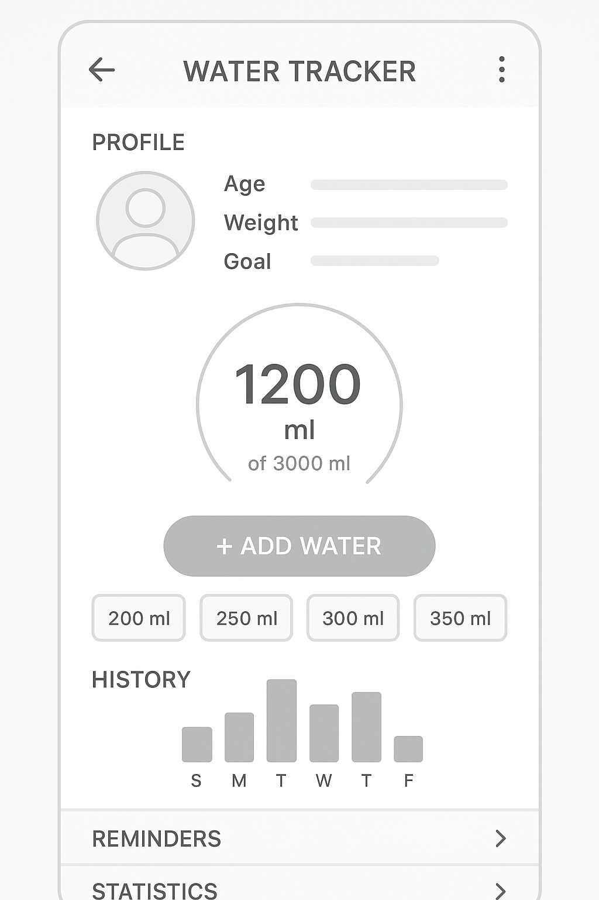

একটা Water Tracker App মানে এমন একটা অ্যাপ, যেটা ব্যবহারকারীকে **প্রতিদিন পর্যাপ্ত পরিমাণ পানি পান করার জন্য রিমাইন্ড করে এবং রেকর্ড রাখে**।

চলো দেখি, এর ভিতরে **কী কী ফিচার** থাকতে পারে — বেসিক থেকে প্রো লেভেল পর্যন্ত:

---

## 🟢 **বেসিক ফিচারসমূহ** (প্রথম ভার্সনে থাকা উচিত):

1. **Daily Water Goal সেট করা**
   ➤ যেমন: 2000ml বা 8 গ্লাস পানি

2. **Water Intake Log করা**
   ➤ ইউজার একটা বোতল/গ্লাস সিলেক্ট করে, এবং ক্লিক করলে সেটা যোগ হয়

3. **Current Progress দেখানো**
   ➤ যেমন: "1200ml drunk, 800ml remaining"

4. **Progress Bar বা Ring**
   ➤ সারাদিনের পানির লক্ষ্যের কতটুকু পূরণ হয়েছে, সেটা ভিজুয়ালি দেখায়

5. **Daily Reset at Midnight**
   ➤ প্রতিদিন রাত ১২ টায় প্রগ্রেস রিসেট হয়ে যায়

---

## 🟡 **ইউজার ফ্রেন্ডলি ফিচার**:

6. **Reminders / Notifications**
   ➤ প্রতি X সময় পর পর রিমাইন্ডার দেবে: “Time to drink water!”

7. **Customizable Glass/Bottle Sizes**
   ➤ ইউজার নিজের মতো করে সাইজ সেট করতে পারবে (250ml, 500ml etc)

8. **History Tracking (Last 7 days, 30 days)**
   ➤ ইউজার কতদিন নিয়মিত পানি খেয়েছে, সেটা চার্ট আকারে দেখা

9. **Dark Mode**
   ➤ চোখের আরাম, ব্যাটারি সাশ্রয়

10. **Profile / Gender & Weight based Recommendation**
    ➤ বয়স, ওজন, আবহাওয়া অনুযায়ী কত ml পানি দরকার — তা ক্যালকুলেট করে goal সাজেস্ট করে

---

## 🔵 **প্রো লেভেল ফিচার (চাইলে)**:

11. **Firebase Sync / Cloud Backup**
    ➤ একাধিক ডিভাইসে ডেটা সংরক্ষণ

12. **Gamification**
    ➤ যেমন “Water Streak”, badges: “7 Days Hydrated!”, etc

13. **Water Intake Analytics (Graph)**
    ➤ দিনে কোন সময় বেশি পানি খাও, কবে কম খেয়েছো — line/bar chart

14. **Voice Assistant Integration**
    ➤ “Hey App, log 1 glass of water!”

15. **Wear OS / Smartwatch Support**
    ➤ ঘড়ি থেকেই পানি লগ করা যায়

---

## 🧪 টেকনিক্যাল দিক (Flutter দিয়ে বানালে):

| টপিক             | টুল                                                     |
| ---------------- | ------------------------------------------------------- |
| Local Storage    | `SharedPreferences` বা `Hive`                           |
| Notification     | `flutter_local_notifications`                           |
| Chart            | `fl_chart` বা `syncfusion_flutter_charts`               |
| Time-based logic | `Timer` বা `Workmanager`                                |
| Firebase         | যদি cloud sync চাও                                      |
| State Management | `setState`, `Provider`, `Riverpod`, `GetX` — যেটা পছন্দ |

---

## 🧑‍💻 যদি MVP বানাতে চাও (Minimum Viable Product):

> ✅ Daily goal set
> ✅ Water add button (250ml)
> ✅ Daily progress bar
> ✅ Reminder after every 2 hours
> ✅ Snackbar / Toast “Water logged”

---

## 🔚 চাইলে আমি তোমার জন্য Flutter এ পুরো UI wireframe বা Starter কোড বানিয়ে দিতে পারি।

> শুধু বলো — তুমি **local storage app** চাও, না Firebase সহ কিছু?

সাথে চাইলে একদম সিরিজ আকারে তোমাকে শেখাতে পারি Flutter দিয়ে Water Tracker বানানো 💧📱
------------------------------------------------------------------------------------------
একদম ঠিক কথা বলছো ভাই! 🔥
**Firebase** শিখে গেলে Flutter দিয়ে পুরো অ্যাপের **backend খেলা** তোমার হাতে থাকবে 💪
আর তখন Water Tracker তো দূরের কথা — চাইলেই বানাতে পারো:

✅ Realtime Chat App
✅ Attendance App
✅ Notes App with cloud sync
✅ Personal Diary
✅ Portfolio CMS

---

## 🔥 কেন Firebase শিখবে?

| 🔹 দিক                 | 🔥 সুবিধা                                     |
| ---------------------- | --------------------------------------------- |
| **Authentication**     | Google, Email, Phone দিয়ে Login super easy    |
| **Firestore Database** | Realtime cloud DB, NoSQL, super-fast          |
| **Storage**            | ছবি, ফাইল রাখতে পারো                          |
| **Hosting**            | ওয়েব অ্যাপও Firebase-এ হোস্ট করা যায়          |
| **Cloud Functions**    | Serverless logic (OTP, Push, Payment)         |
| **Push Notifications** | Directly ফোনে Notification পাঠাও              |
| **Analytics**          | ইউজার কোথায় কেমন behave করছে, ট্র্যাক করা যায় |

---

## ✅ Firebase শেখার Roadmap (Flutter ফোকাস করে):

1. 🔐 **Authentication (Email/Password, Google Sign In)**
2. 📦 **Cloud Firestore (CRUD – Create/Read/Update/Delete)**
3. ☁️ **Cloud Storage (Image Upload/Download)**
4. 🔔 **Push Notifications (FCM)**
5. 🧠 **Firebase Rules & Security**
6. 🛠 **Firebase Functions (Advanced, optional)**

---

## 🎯 চাইলে আমি তোমার জন্য শিখার টপিক ধরে ধরে সিরিজ আকারে দিতে পারি:

> যেমন:
> 🔸 Lesson 1: Firebase Setup + Connect to Flutter
> 🔸 Lesson 2: Sign In / Sign Up
> 🔸 Lesson 3: Data Save & Read
> 🔸 Lesson 4: Realtime Update
> 🔸 Lesson 5: File Upload & Download
> 🔸 Bonus: Custom Notification, Authentication State, Role-based Access

---

## 📌 এক লাইন বলি:

> **Flutter শিখে তুমি অ্যাপ বানাতে পারো, আর Firebase শিখে সেটা "Alive" করতে পারো!** 🚀

তাই ভাই, **Firebase শেখো – খেলা হবে 🔥**
বললেই শুরু করে দেই হাতে-কলমে Firebase শেখানো 💯

--------------------------------------------------------------------------------------------
একটি Water Tracker App (যেটা দিয়ে ইউজার তাদের দৈনিক পানি পান করার পরিমাণ ট্র্যাক করতে পারে) তে সাধারণত নিচের ফিচারগুলো থাকা উচিত:

## 🔹 **Water Tracker App এর প্রয়োজনীয় ফিচারসমূহ:**

### 1. **User Profile:**

* বয়স, ওজন, লিঙ্গ, দৈহিক সক্রিয়তা অনুযায়ী দৈনিক পানি প্রয়োজন হিসাব করার ফিচার।
* ব্যক্তিগত লক্ষ্য নির্ধারণ (Daily Water Goal)।

### 2. **Water Intake Log:**

* প্রতিবার কত মিলিলিটার পানি পান করেছে সেটা এন্ট্রি করার অপশন।
* বিভিন্ন গ্লাস বা বোতলের প্রিসেট সাইজ সিলেক্ট করার সুবিধা।

### 3. **Daily Goal Progress Bar:**

* গ্রাফ বা সার্কুলার প্রগ্রেস বার দেখিয়ে ইউজারকে জানানো কতটুকু লক্ষ্য পূরণ হয়েছে।

### 4. **Reminder/Notification:**

* নির্দিষ্ট সময় পরপর পানি পান করার রিমাইন্ডার।
* কাস্টমাইজেবল রিমাইন্ডার টাইম এবং শব্দ।

### 5. **History and Analytics:**

* দৈনিক, সাপ্তাহিক, মাসিক রিপোর্ট।
* গ্রাফ বা চার্টে পানি পান করার অভ্যাস দেখানো।

### 6. **Achievements and Rewards:**

* নির্দিষ্ট লক্ষ্য পূরণে ব্যাজ বা রিওয়ার্ড সিস্টেম।
* ইউজারের মধ্যে অনুপ্রেরণা তৈরি করার জন্য।

### 7. **Custom Drink Options:**

* শুধু পানি নয়, অন্যান্য পানীয় (জুস, চা) ট্র্যাক করার অপশন।

### 8. **Dark Mode Support:**

* ইউজারের চোখের জন্য আরামদায়ক থিম সাপোর্ট।

### 9. **Data Backup and Sync:**

* Google Drive বা Cloud এ ডাটা সেভ করার সুবিধা।
* মাল্টি ডিভাইস সাপোর্ট।

### 10. **Widget Support:**

* হোম স্ক্রিনে ছোট widget দিয়ে পানি খাওয়ার শর্টকাট।

---

## ✅ যদি তুমি চাও, আমি তোমাকে এই অ্যাপের জন্য UI ডিজাইন বা Wireframe ড্র করে দিতে পারি।

বললে আমি করে দেই। 😊

তোমার কি এই ফিচারগুলোর মধ্যে কিছু বিশেষভাবে দরকার?
